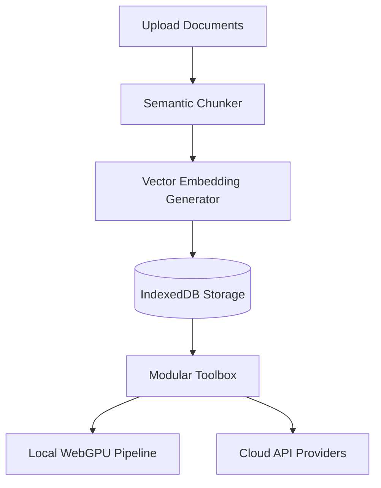

# NeuroSpark ⚡

[](https://opensource.org/licenses/MIT)
[](#)
[](#)
[](http://makeapullrequest.com)

**NeuroSpark** is an industry-standard, lightweight Progressive Web App (PWA) designed for modern browser-based offline document interaction and intelligence. Inspired by tools like Google NotebookLM, it enables users to organize documents into cohesive conceptual "Decks" and query them using either cloud APIs or **fully local, offline AI models running on the user's hardware via WebGPU**.

* 🔗 **Live Deployment:** [preetamrtd.github.io/NeuroSpark/](https://preetamrtd.github.io/NeuroSpark/)
* 📂 **Repository:** [github.com/PreetamRtd/NeuroSpark](https://github.com/PreetamRtd/NeuroSpark)

---

## 🚀 Key Features

* **Fully Offline AI Engine (WebGPU):** Run lightweight LLMs (like `Qwen-2.5-0.5B-Instruct-ONNX`) and embedding models (like `all-MiniLM-L6-v2`) entirely in-browser. Zero server costs, 100% data privacy.
* **Hybrid Execution Modes:** Easily toggle between Cloud APIs (Gemini, OpenAI, Claude) and local offline execution.
* **Semantic Paragraph/Sentence Chunker**: Chunks document text semantically, keeping paragraphs and sentence concepts together to maintain high semantic coherence for RAG retrieval.
* **Modular Toolbox**: Extensible, isolated workspace tools that operate directly on the loaded deck data:
  * 🔍 **RAG Search**: Query vectors in the deck with cosine similarity semantic matching.
  * 📝 **Magic Todo**: Subtask planner inspired by goblin.tools.
  * 💬 **AI Chat Tutor**: Conversational RAG-powered tutor to discuss deck notes.
  * 📊 **Mermaid Visualizer**: Interactive diagramming and map rendering.
  * 📖 **Focus Reader**: Distraction-free conceptual document reader.
* **IndexedDB Sandboxed Caching**: All decks, source files, and configuration credentials are saved locally on your device using IndexedDB with fallback caching.
* **Premium Design System**: Sleek minimalist dark theme with responsive styling, custom transitions, and adaptive mobile overlays.

---

## ⚙️ Architecture & Data Flow

NeuroSpark uses a local-first architecture where data never leaves the client's browser unless cloud-mode is explicitly enabled.



### Chunking Mechanics
Unlike traditional sliding windows which split text at hard character boundaries, NeuroSpark uses a **Structure-Aware Semantic Chunker**:
1. **Paragraph Splits**: Groups paragraphs based on double newlines (`\n\n`) to preserve distinct conceptual topics.
2. **Sentence Integrity**: Splits longer paragraphs using sentence boundary regex (`(?<=[.!?])\s+`) to prevent breaking ideas mid-clause.
3. **Clustering**: Joins adjacent sections up to `maxLength` to maximize prompt context efficiency.

---

## 📂 File Structure

```text
NeuroSpark/
├── assets/
│   ├── brain-2.png         # Brand illustrations & icons
│   ├── icon-192.png        # PWA splash icon (192px)
│   └── icon-512.png        # PWA splash icon (512px)
├── tools/                  # Isolated Workspace Tools
│   ├── aiChatTutor.js      # Conversational tutor RAG tool
│   ├── focusReader.js      # Reader tool
│   ├── magicTodo.js        # Magic subtask planner tool
│   ├── mermaidVisualizer.js# Diagram renderer tool
│   └── ragSearch.js        # Semantic similarity vector search
├── index.html              # Main application markup & UI controller
├── index.css               # Pitch-black responsive style system
├── storage.js              # Offline database controller (IndexedDB wrapper)
├── webgpu.js               # WebGPU diagnostics & local model configurations
├── sw.js                   # Service Worker (offline stale-while-revalidate asset cache)
├── manifest.json           # PWA standalone configuration manifest
└── README.md               # Hackathon submission documentation
```

---

## ⚡ Quick Start (Local Run)

Since the PWA uses modern browser APIs like WebGPU and Service Workers, it must be run over a secure context (`localhost` or `https://`).

1. **Clone the repository:**
   ```bash
   git clone https://github.com/PreetamRtd/NeuroSpark.git
   cd NeuroSpark
   ```

2. **Start a local HTTP server:**
   You can use python, node, or any light server:
   ```bash
   # Python 3
   python3 -m http.server 3000
   
   # Or Node.js (npx)
   npx http-server -p 3000
   ```

3. **Open in browser:**
   Navigate to `http://localhost:3000` on any WebGPU-compatible browser (e.g. Chrome, Edge, or Safari 18+).

---

## 🛠️ Developer Guide: Adding a Custom Tool

NeuroSpark makes it easy to write new tools. All workspace tools are isolated IIFEs registered on the global `window.NeuroSparkTools` array. 

### 1. Write the Tool File (`tools/myTool.js`)
Create a new file in the `tools/` directory matching the following structure:

```javascript
(function () {
    if (!window.NeuroSparkTools) window.NeuroSparkTools = [];

    const myTool = {
        id: 'my-custom-tool',
        name: 'Custom Helper',
        description: 'Does something awesome with your documents.',
        icon: `<svg width="24" height="24" viewBox="0 0 24 24" fill="none" stroke="currentColor" stroke-width="2"><circle cx="12" cy="12" r="10"/></svg>`,

        render(container, deck, onBack) {
            container.innerHTML = `
                <div style="padding: 16px;">
                    <h3>${this.name}</h3>
                    <p>Current Deck has ${deck.sources.length} document(s).</p>
                    <button class="back-btn" id="btnBack">← Back to Toolbox</button>
                </div>
            `;
            container.querySelector('#btnBack').addEventListener('click', onBack);
        }
    };

    window.NeuroSparkTools.push(myTool);
})();
```

### 2. Register the Tool in `index.html`
Insert the script tag for your custom tool inside `index.html` below the other tools:

```html
<!-- Load Isolated Tools -->
<script src="tools/ragSearch.js"></script>
<script src="tools/magicTodo.js"></script>
<script src="tools/aiChatTutor.js"></script>
<script src="tools/mermaidVisualizer.js"></script>
<script src="tools/focusReader.js"></script>
<script src="tools/myTool.js"></script> <!-- Your tool here -->
```

The system automatically detects the new script, registers it, and adds it to the Deck dashboard sidebar toolbox.

---

## 📝 License
This project is licensed under the MIT License. See [LICENSE](LICENSE) for details.
